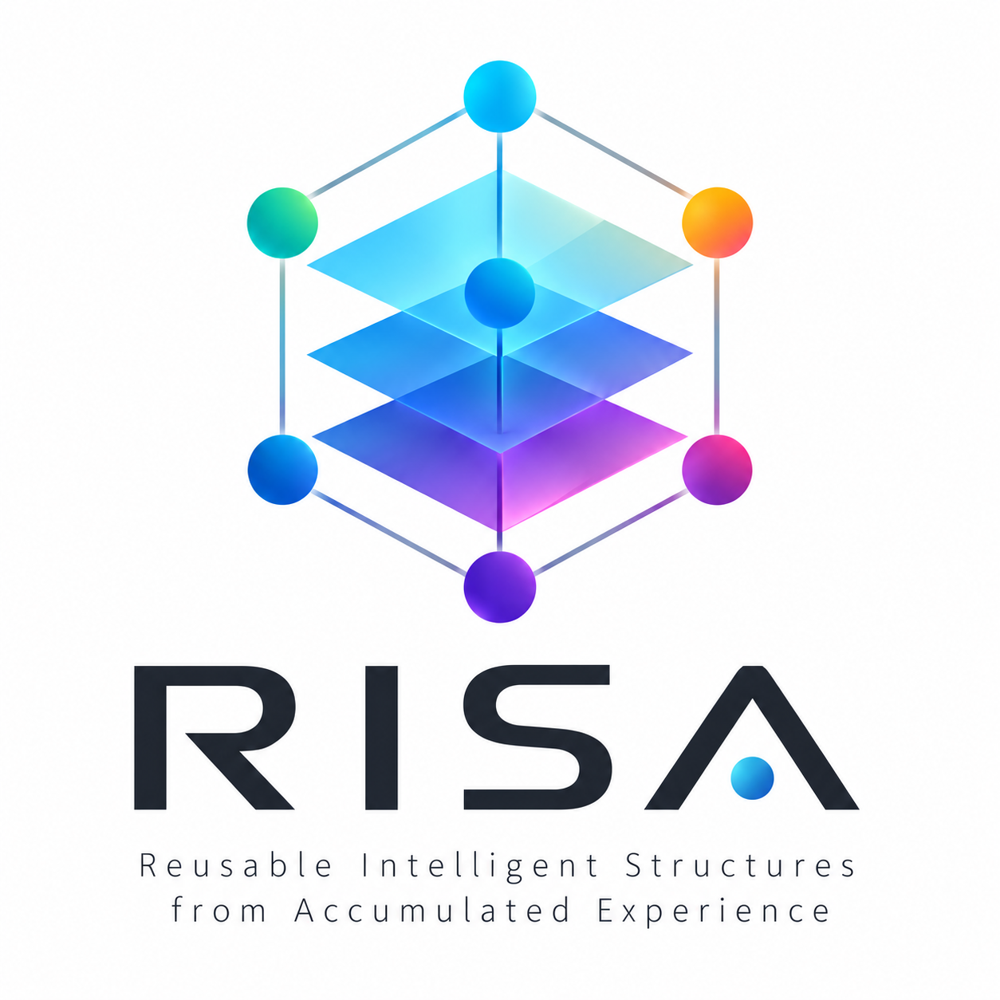

<p align="center">
  
</p>

# RISA

**RISA** (Relationally Involving Self-organizing Architecture) is a Python research prototype for learning reusable structure from experience. It ingests structured events, builds a relational world model, discovers recurring transitions and candidate concepts, and uses that model for prediction and planning.

The central research hypothesis is that experience can **condense into reusable internal structure**. More experience should improve performance on unfamiliar problems without requiring storage and search work to grow in proportion to the event log. A concept, in this view, is a structure reused across many experiences, not a label supplied in advance.

RISA has a working structured-world core. It has **not** established a general advantage over strong baselines, demonstrated recursive concept formation, or shown end-to-end learning at 100,000 events. The current priority is to test which structural mechanisms actually help under change before adding new perception or execution layers.

## Current evidence

| Stage          | What was measured                                                                      | Result and limit                                                                                                                                                                                                                                                                                                                                                                                              |
| -------------- | -------------------------------------------------------------------------------------- | ------------------------------------------------------------------------------------------------------------------------------------------------------------------------------------------------------------------------------------------------------------------------------------------------------------------------------------------------------------------------------------------------------------- |
| G1             | Synthetic control, composition, binding, uncertainty and A→B→A drift tasks             | Structural primitives support multi-step planning, but RISA tied the strongest applicable grounded-transition baseline on the main static tasks. The original B drift phase reached 33.3% success. [Report](docs/G1-Comparative-Evaluation-2026-09-08.md)                                                                                                                                                     |
| G2             | Targeted tests of learned applicability, role binding, candidate reuse and persistence | Several targeted ablations improved, including learned-precondition composition at 100% versus 0% and binding at 100% versus 75%. Supplied-precondition composition still tied the grounded table. These are task-specific results, not general superiority. [Structural reuse](docs/G2-Structural-Reuse-Evaluation-2026-09-08.md) · [Derived candidates](docs/G2-Derived-Candidate-Evaluation-2026-09-11.md) |
| G2.5–G2.6      | Roles induced from relation position and refined when outcomes conflict                | One-hop induced roles matched supplied roles on the reported tasks; targeted two-hop refinement improved prediction, composition and planning over restricted role conditions. [Structural roles](docs/G2-Structural-Role-Evaluation-2026-09-12.md) · [Role disambiguation](docs/G2-Role-Disambiguation-Evaluation-2026-09-13.md)                                                                             |
| G2 persistence | Full G2 states across five seeds                                                       | Schema v4 reduced mean serialized state from 134,478 to 102,287 bytes (23.94%) with no reported reload differences over 5,000 predictions and 2,250 plans, plus composition and simulation checks. The storage gap to simpler baselines remains. [Report](docs/G2-Persistence-Evaluation-2026-09-10.md)                                                                                                       |
| G3.1           | Indexed prediction access and bounded Replay selection at 1k, 10k and 100k events      | Indexed and full-scan `PredictionResult` payloads matched in all nine scale rows. Event-access work improved by at least 63.49× and p95 latency by at least 20.37×; Replay selection stayed within 128 events. The fixture did **not** execute full graph construction, online learning, candidate discovery or planning at 100k. [Report](docs/G3-Scale-Evaluation-2026-09-13.md)                            |
| G3.2 preflight | Five seeds and seven requested split/merge/dormancy conditions under A→B→A drift       | The development preflight completed 35 rows but **failed its mechanism-opportunity gate**: adopted merges, dormant candidates and executed Primitive context splits were zero in every row. Equal recovery across conditions cannot be interpreted as evidence that these mechanisms are ineffective. No independent G3.2 final evaluation has run. [Report](docs/G3.2-Drift-Preflight-2026-09-16.md)         |

The G3.2 preflight exposed a concrete lifecycle gap. A1 produced merge proposals in all five Full runs, but proposals did not become adopted structures in the online drift path. The next experiment must provide separate candidate-development, candidate-adoption and experiment-final evidence, count supervised validation labels in the adaptation budget, and verify that each mechanism actually executes. See the [G3.2 protocol](docs/G3.2-Drift-Protocol.md) and [current roadmap](docs/ROADMAP.md).

## How RISA works

1. **Events and graph.** A structured `Event` records actors, actions, targets, context, observed effects, relations and optional before-state information. Ingestion adds evidence-bearing nodes and edges to the graph.
2. **Learning and structural reuse.** RISA learns outcome counts, shared patterns, transition Primitives, role signatures, applicability conditions and unnamed concept candidates from repeated evidence. Candidate promotion uses disjoint development and final evidence.
3. **Prediction and adaptation.** Predictions return effects, scores, evidence IDs and structural paths. Pre-update validation, bounded Replay and change hypotheses can update the model. Context splitting, candidate merging and dormancy exist, but their causal value under drift is still unproven.
4. **Planning.** Forecasting, branch simulation, goal evaluation and counterfactual planning use the learned model. The planner supports state and numeric constraints, AND/OR goal decomposition, partial-order execution and threat diagnostics. Planning quality must be evaluated separately from world-model quality.
5. **Persistence.** The state uses schema v4. Rebuildable readout indexes are derived from Events on load; compact graph and candidate records preserve the evidence and evaluation state needed for reconstruction.

RISA currently accepts **structured JSON events**. Natural language, image and audio perception are outside this core. Planned neural, SNN, logic-gate and hardware paths are conditional on evidence that structural learning itself works.

## Repository layout

| Path               | Purpose                                                                      |
| ------------------ | ---------------------------------------------------------------------------- |
| `risa/core/`       | Event, graph, candidate and state models                                     |
| `risa/engine/`     | Ingestion, learning, discovery, prediction, Replay, planning and persistence |
| `risa/evaluation/` | Benchmark models and G3.2 measurement helpers                                |
| `risa/cli/`        | Command-line interface                                                       |
| `experiments/`     | Versioned manifests and reproducible experiment runners                      |
| `docs/`            | Roadmap, protocols, reports and machine-readable results                     |
| `data/`            | Small structured-world examples                                              |
| `tests/`           | Regression tests                                                             |

## Quick start

Requires Python 3.10 or newer. Run these commands from the repository root:

```bash
python3 -m risa.cli.main train data/toy_world.json --state-dir /tmp/risa-toy
python3 -m risa.cli.main predict --actor wolf --action run --state-dir /tmp/risa-toy
python3 -m pytest -q
```

The `wolf run` example is a smoke check: action frequency can produce the same answer. It does not establish structural generalization.

To inspect stateful branches and constraints:

```bash
python3 -m risa.cli.main train data/branching_world.json --state-dir /tmp/risa-branch
python3 -m risa.cli.main simulate --start-action route \
  --start-variable energy=5 --max-steps 2 --max-branches 4 \
  --state-dir /tmp/risa-branch
python3 -m risa.cli.main evaluate --start-action route \
  --require-state safe_path --forbid-state fast_path \
  --start-variable energy=5 --max-steps 2 \
  --state-dir /tmp/risa-branch
```

The CLI also provides `inspect`, `forecast`, `compose` and `plan`. Run `python3 -m risa.cli.main --help` or a subcommand's `--help` for options. Examples for conjunction, disjunction and nested AND/OR plans are in `data/`.

## Reproduce the research checks

```bash
python3 -m experiments.comparative_evaluation \
  --manifest experiments/g1_manifest.json --output /tmp/g1-results.json
python3 -m experiments.scale_evaluation \
  --manifest experiments/g3_scale_manifest.json --output /tmp/g3-scale-results.json
python3 -m experiments.g3_drift_preflight \
  --manifest experiments/g3_drift_preflight_manifest.json \
  --output /tmp/g3-drift-preflight-results.json
```

The G3.2 preflight is a **development diagnostic**. Its expected opportunity-gate result is `fail`; it is not a substitute for an independent final experiment. G3.1's 100k full-scan reference can take substantially longer than the other checks. The committed result artifacts and their manifests are linked from the corresponding reports.

## Roadmap

- [Done] G0–G2.6: structured-event semantics, targeted comparisons, candidate lifecycle, induced roles and persistence checks.
- [Done] G3.1: indexed prediction access and bounded Replay selection measured through 100k synthetic events.
- [Done] G3.2 groundwork: mechanism switches, drift metrics, online runner, candidate-extension validation and a preflight that exposed missing mechanism opportunities.
- [Next] G3.2: run a valid A→B→A ablation with split, merge and dormancy active in the relevant conditions. Primary metrics are `recovery_events`, `retention_after_return`, `adaptation_touch_ratio` and `replay_cost_per_recovery`.
- [Later] G3.3: measure ingestion through persistence at 1k, 10k and 100k events; decide whether to attempt 1M from those results.
- [Later] G3.4: measure structure growth, description length, storage per event, candidate generation and planner work per query.
- [Later] G4: test second-generation concepts, self-formed hierarchy and transfer to a new small world using lineage-disjoint held-out evidence.

The long-term test is whether more experience produces more reusable structure, lower marginal storage and search cost, and higher success on unseen problems **at the same time**. If structure counts and costs grow roughly with the event log while only accuracy improves, the condensation hypothesis needs revision. The [roadmap](docs/ROADMAP.md) defines the evidence gates and later research options.

## Documentation

- [Roadmap](docs/ROADMAP.md)
- [G3.2 drift protocol](docs/G3.2-Drift-Protocol.md) and [preflight report](docs/G3.2-Drift-Preflight-2026-09-16.md)
- [G3.1 scale report](docs/G3-Scale-Evaluation-2026-09-13.md)
- [G2 structural reuse](docs/G2-Structural-Reuse-Evaluation-2026-09-08.md), [derived candidates](docs/G2-Derived-Candidate-Evaluation-2026-09-11.md), [context conjunctions](docs/G2-Context-Conjunction-Evaluation-2026-09-12.md), [persistence](docs/G2-Persistence-Evaluation-2026-09-10.md)
- [G1 comparative evaluation](docs/G1-Comparative-Evaluation-2026-09-08.md)
- [MVP technical design](docs/RISA-MVP-1-Technical-Design.md) and [concept condensation notes](docs/RISA-Undivided-Knowledge-and-Concept-Condensation.md)

## License

A license has not been specified yet.
